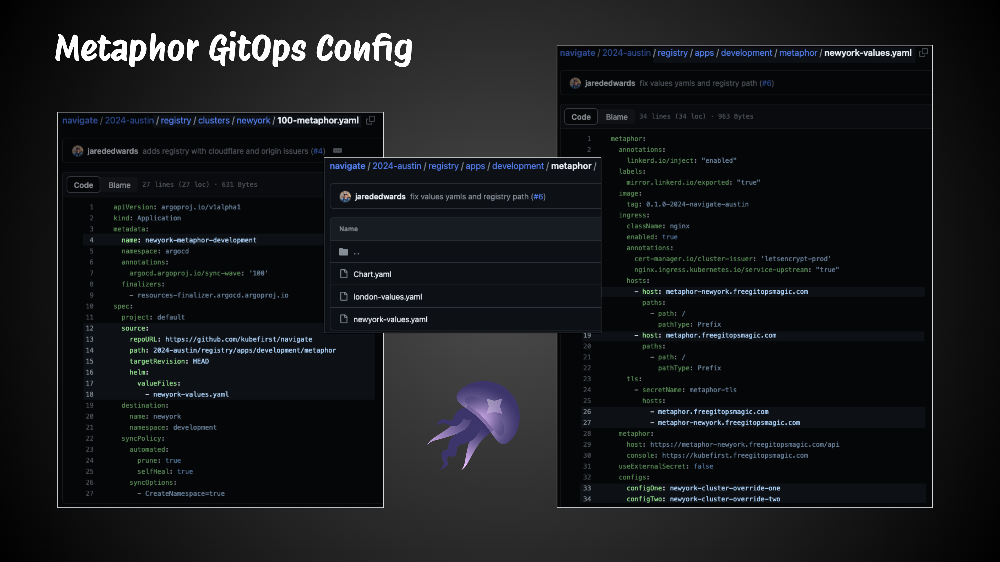
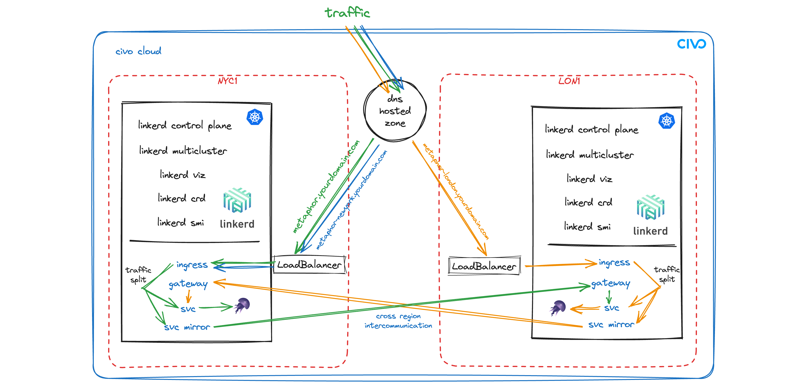

# Civo Navigate Workshop - Civo DNS variation

## Step 1: Workshop Setup 

### 1.1 Command and Workshop Prerequisites

- k3d: local kubernetes
    - install: `brew install k3d`
- watch: repeat a command to watch resources
    - install: `brew install watch`
- kubectl: interact with kubernetes
    - install: `brew install kubectl`
- linkerd: cli for linkerd control plane
    - install: `brew install linkerd`
- pbcopy: copy command results to the clipboard
    - install: `brew install pbcopy`
- base64: string encoding
    - install: `brew install coreutils`
- civo account
    - set nameserver records at your domain registrar to `ns0.civo.com` and `ns1.civo.com`
    - add your domain in your [civo dns](https://dashboard.civo.com/dns)

### 1.2 Clone the `navigate` git repository
```sh
git clone https://github.com/kubefirst/navigate
cd navigate
```

### 1.3 create a local bootstrap cluster

We'll provision a local k3d cluster that will need a `CIVO_TOKEN` added as a kubernetes secret. This `k3d` cluster will also have a few additional [manifests](../manifests/bootstrap-k3d.yaml) that install argocd to the new cluster with a few default configurations we'll take advantage of.

```sh
k3d cluster create kubefirst \
  --agents "1" \
  --agents-memory "4096m" \
  --volume $PWD/2024-austin/manifests/bootstrap-k3d.yaml:/var/lib/rancher/k3s/server/manifests/bootstrap-k3d.yaml
```

The result will be a local bootstrap k3d cluster with the necessary components for app and infrastructure management.


### 1.4 export your `CIVO_TOKEN` for provisioning cloud infrastructure
Replace the x's with your actual API Key. It's available on your [profile security page](https://dashboard.civo.com/security) in your Civo account.
```sh
export CIVO_TOKEN=xxxxxxxxxxxxxxxxxxxxxxxxxxxxxxxxxxx
```

The `CIVO_TOKEN` will be used by the crossplane terraform provider to allow for provisioning of CIVO cloud infrastructure as well as for external-dns to create and adjust DNS records in your CIVO cloud account.
```sh
kubectl -n crossplane-system create secret generic crossplane-secrets \
  --from-literal=CIVO_TOKEN=$CIVO_TOKEN \
  --from-literal=TF_VAR_civo_token=$CIVO_TOKEN
```

### 1.5 wait for all pods in k3d to be Running / Completed

```sh
watch kubectl get pods -A
```
note: use keystroke `Ctrl`+`c` to exit the watch command

### 1.6 port-forward to argocd ui

```sh
kubectl -n argocd port-forward svc/argocd-server 8888:80 
```

### 1.7 open a new terminal and set the `KUBECONFIG` environment variable

```sh
export KUBECONFIG=$(k3d kubeconfig write kubefirst)
```

### 1.8 copy the argocd root password to your clipboard

```sh
kubectl -n argocd get secret/argocd-initial-admin-secret -ojsonpath='{.data.password}' | base64 -D | pbcopy
```

If Argo CD becomes unresponsive in your browser at any time, you will need to refresh your port-forward. To do so, use 
keystroke `Ctrl`+`c` to exit the port-forward command, and then reexecute the port-forward command

The port-forward command above will tie up your terminal, please start a second terminal session to continue command executions. 

### 1.9 login to argocd

[http://localhost:8888](http://localhost:8888)

username: `admin`

password: (paste from your clipboard)

# Step 2: Bootstrap

### 2.1 bootstrap the `k3d` cluster with crossplane and install the terraform provider
```sh
kubectl apply -f https://raw.githubusercontent.com/kubefirst/navigate/main/2024-austin/bootstrap/bootstrap.yaml
```

once all bootstrap items have synced, you should see the following in argo cd


# Step 3: Registry


### 3.1 explore the registry folder structure


### 3.1 apply the registry to provision new cloud infrastructure and bootstrap the cloud clusters

```sh
kubectl apply -f https://raw.githubusercontent.com/kubefirst/navigate/main/2024-austin/registry/registry.yaml
```




### 3.2 watch the registry in argocd ui
once the cluster-infrastructure sync waves have completed, its a good time to get the kubeconfig files for the two clusters so we can interact with them

```sh
civo k8s config --region nyc1 newyork --save
civo k8s config --region lon1 london --save
```

### what just happened?



We just created to new CIVO kubernetes clusters in multiple regions using Infrastructure as Code. Once the new clusters were ready, we used the Argo CD gitops engine to install a handfull of applications to make them capable of serving traffic on the internet, with short lived tls certificates, leveraging your dns zone. The two clusters are prepared with multicluster linkerd service mesh which we'll focus on through this workshop.

### explore metaphor, your new demo application running in both clusters

[https://metaphor-newyork.gitopsmagic.com](https://metaphor-newyork.gitopsmagic.com)

[https://metaphor.gitopsmagic.com](https://metaphor.gitopsmagic.com)

[https://metaphor-london.gitopsmagic.com](https://metaphor-london.gitopsmagic.com)


### 3.3 link the newyork cluster with the london cluster
this command will take the necessary information from each kubeconfig and install a `Link` resource that will allow for traffic switching using the linkerd-smi `TrafficSplit`
```sh
kubectx newyork
linkerd --context=london multicluster link --cluster-name london |
  kubectl --context=newyork apply -f -
```

### 3.4 reroute traffic to your mirrored service
```sh
cat <<EOF | kubectl apply -f -
apiVersion: split.smi-spec.io/v1alpha2
kind: TrafficSplit
metadata:
  name: newyork-metaphor-development-split
  namespace: development
spec:
  service: newyork-metaphor-development
  backends:
  - service: newyork-metaphor-development
    weight: 0
  - service: london-metaphor-development-london
    weight: 100
EOF
```

### 3.5 change traffic 50/50 between the newyork and london services

cat <<EOF | kubectl apply -f -
apiVersion: split.smi-spec.io/v1alpha2
kind: TrafficSplit
metadata:
  name: newyork-metaphor-development-split
  namespace: development
spec:
  service: newyork-metaphor-development
  backends:
  - service: newyork-metaphor-development
    weight: 50
  - service: london-metaphor-development-london
    weight: 50
EOF
```


### 3.6 link the frankfurt cluster with the austin for failover

this command will take the necessary information from each kubeconfig and install a `Link` resource that will allow for traffic switching using the linkerd-smi `TrafficSplit`

```sh
kubectx london
linkerd --context=newyork multicluster link --cluster-name newyork |
  kubectl --context=london apply -f -
```

### 3.7 shift ingress traffic to the london cluster

remove the vanity host on the hosts of your newyork metaphor

[https://github.com/kubefirst/navigate/blob/main/2024-austin/registry/apps/development/metaphor/newyork-values.yaml#L19-L22](https://github.com/kubefirst/navigate/blob/main/2024-austin/registry/apps/development/metaphor/newyork-values.yaml#L19-L22)

and from the tls of your newyork metaphor

[https://github.com/kubefirst/navigate/blob/main/2024-austin/registry/apps/development/metaphor/newyork-values.yaml#L26](https://github.com/kubefirst/navigate/blob/main/2024-austin/registry/apps/development/metaphor/newyork-values.yaml#L26)

and then add those 2 sections to your london metaphor configurations

[https://github.com/kubefirst/navigate/blob/main/2024-austin/registry/apps/development/metaphor/london-values.yaml](https://github.com/kubefirst/navigate/blob/main/2024-austin/registry/apps/development/metaphor/london-values.yaml)

pull request both changes to main to shift ingress traffic from new york to london.


